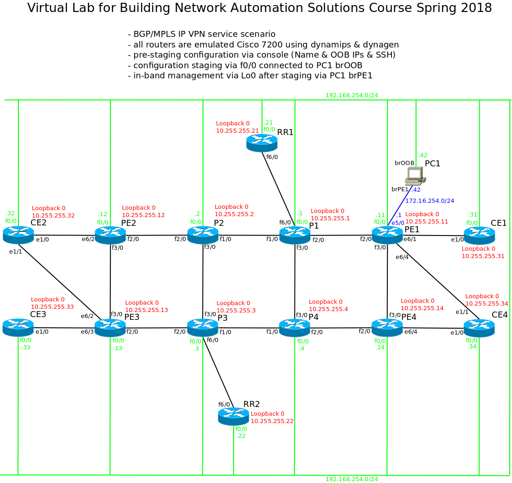
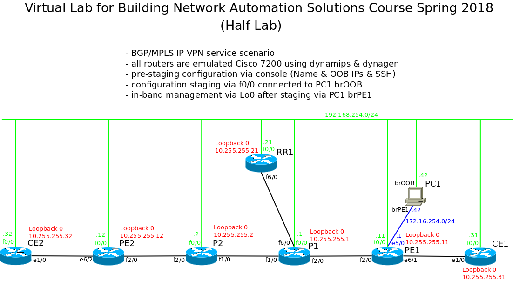
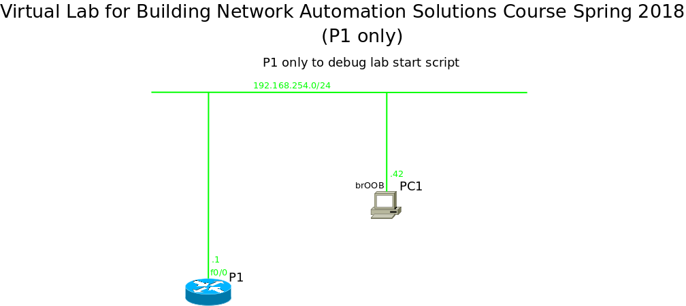

# Homework 1: Build the Lab

The first homework (or hands-on assignment) is to build a lab for
experimenting with network automation. This lab can be used as the basis
to work on later hands-on assignments.

While it is not required to use the same lab for all assignments, doing
so might help in understanding the automation part instead of learning
how to build different labs. ;-)

## Selecting the Gear

I use emulated Cisco 7200 routers as lab devices. The emulation is done
using dynmips in hypervisor mode and dynagen to create the topology from
a simple text file.

Cisco IOS is supported by upstream Ansible without need for third party
modules, I know Cisco IOS quite well, and I am currently using Ansible to
automate network tests for IOS XE and IOS XR based routers. Thus I should
be able to focus on the network automation part, instead of learning how
to connect the Ansible automation framework to the chosen network devices.

There even is upstream support in NAPALM to work with Cisco IOS based
devices, thus this choice may allow me to explore NAPALM and Salt, too.

Since early experiments suggest that the full lab topology I would like
to use might be a bit too much for my trusty old laptop, especially with
Ansible running on it as well, I may change to a smaller lab comprising
just half of the routers.

## Lab Topology

My lab is intended to simulate a service provider network offering a
BGP/MPLS IP VPN service.

### Full Lab

The full network is comprised of two planes, each comprising two P
routers, two PE routers, one route reflector, and two CE routers.



### Half Lab

If I go with the smaller lab, I will just omit the second plane.

**Update 2018-02-11** I do use the Half Lab.



The virtual lab is connected to my GNU/Linux laptop via two bridges
that connect to tap devices which connect to router interfaces. The first
bridge, `brOOB`, is used to connect one interface of each router and
the laptop to a shared Ethernet segment. This allows easy connectivity
to the routers to provision an MPLS transport network, as could be done
when staging new routers. After the infrastructure is available, `brPE1`
connects the laptop and the PE1 router. The PE1 router then provides
in-band connectivity to the loopback interfaces of all routers, which
shall be used to provision L3VPN services.

### Python Virtual Environment

The network automation tools run on my laptop, which uses GNU/Linux
natively. To use the current Ansible (and potentially NAPALM and Salt),
the network automation tools are installed into a Python Virtual
Environment.

To create the Python Virtual Environment I used the following commands
on my Ubuntu 14.04 LTS system:

```
sudo apt-get install python-dev python3-dev libffi-dev libyaml-dev sshpass
virtualenv ansible
source ansible/bin/activate
pip install --upgrade setuptools
pip install cffi
pip install ansible
```

**Update 2018-02-24** The Ansible installation in the Python Virtual
Environment was incomplete, and because of this the `ios_command` module
did not work. To fix this I needed to install two additional Python
packages (see the *Interlude* section from [homework 2](../hw2-reports/)):

```
pip install enum34 ipaddress
```

While in the Python Virtual Environment (`source ansible/bin/activate`),
I can execute Ansible commands. The command `deactivate` is used to
exit the Python Virtual Environment.

### Initial Lab Configuration

Since Ansible is supposed to be used via TCP/IP (instead of e.g. serial
console), the lab routers need to be pre-provisioned with a basic
configuration that provides IP connectivity and an SSH server. This
pre-staging configuration can be applied via copy&paste to the router
consoles. With this configuration, Ansible can connect to every router,
which suffices for the first homework and provides a starting point for
the upcoming hands-on exercises.

## Lab Automation

Not only is the virtual lab intended to learn network automation, starting
and stopping it is automated as well. The virtual lab configuration and
control scripts can be found in the [lab/](lab/) directory.

### Starting the Lab

The script [`start_lab`](lab/start_lab) creates the GNU/Linux network
devices needed to connect to the virtual lab and then starts GNU `screen`
in which to start `dynamips` and `dynagen`. The script then waits for
`dynagen` and `dynamips` to stop, after which it removes the GNU/Linux
network devices it created.

#### Debugging

In order to debug this script I have used a minimalistic lab setup
consisting of just one router.



### Creating and Deploying Pre-Provisioning Configuration

The router configuration needed to connect via Ansible is generated via
GNU `m4` from a template (`template.m4`) and a per-router definition file
(`<ROUTER_NAME>.m4`) to specify both the router's name and IP address.
Generation of the configuration files is controlled using GNU `make`. To
deploy the configuration to the routers I have written an `expect` script
that connects to the router via the virtual console server provided by
`dynamips`, reads the generated configuration file, applies it line by
line, and then saves the configuration. All this can be found in the
[pre-staging/](pre-staging/) directory.

## Testing Ansible

After creating an initial Ansible configuration
([ansible.cfg](ansible/ansible.cfg)) and the
[inventory](ansible/inventories/half_lab/) for the Half Lab, Ansible
from the Virtual Python Environment can access the routers:

```
(ansible)$ ansible OOB -m raw -v -a 'show clock'
Using /home/auerswald/work/bnas2018/bnas2018-solutions/hw1-the_lab/ansible/ansible.cfg as config file
P2-oob.lab.local | SUCCESS | rc=0 >>

*20:19:50.387 UTC Sun Feb 11 2018Shared connection to 192.168.254.2 closed.
Connection to 192.168.254.2 closed by remote host.


P1-oob.lab.local | SUCCESS | rc=0 >>

*20:19:50.419 UTC Sun Feb 11 2018Shared connection to 192.168.254.1 closed.
Connection to 192.168.254.1 closed by remote host.


RR1-oob.lab.local | SUCCESS | rc=0 >>

*20:19:51.335 UTC Sun Feb 11 2018Shared connection to 192.168.254.21 closed.
Connection to 192.168.254.21 closed by remote host.


PE2-oob.lab.local | SUCCESS | rc=0 >>

*20:19:52.459 UTC Sun Feb 11 2018Shared connection to 192.168.254.12 closed.
Connection to 192.168.254.12 closed by remote host.


PE1-oob.lab.local | SUCCESS | rc=0 >>

*20:19:43.095 UTC Sun Feb 11 2018Shared connection to 192.168.254.11 closed.
Connection to 192.168.254.11 closed by remote host.


CE1-oob.lab.local | SUCCESS | rc=0 >>

*20:19:59.791 UTC Sun Feb 11 2018Shared connection to 192.168.254.31 closed.
Connection to 192.168.254.31 closed by remote host.


CE2-oob.lab.local | SUCCESS | rc=0 >>

*20:19:59.955 UTC Sun Feb 11 2018Shared connection to 192.168.254.32 closed.
Connection to 192.168.254.32 closed by remote host.
```

## References

* [Ansible](https://www.ansible.com/)
* [BGP/MPLS IP Virtual Private Networks (VPNs)](https://tools.ietf.org/html/rfc4364)
* [Dynagen](https://sourceforge.net/projects/dyna-gen/)
* [Dynamips](https://github.com/GNS3/dynamips/)
* [Expect](https://core.tcl.tk/expect/)
* [GNU M4](https://www.gnu.org/software/m4/)
* [GNU Make](https://www.gnu.org/software/make/)
* [GNU Screen](https://www.gnu.org/software/screen/)
* [iproute2](https://git.kernel.org/pub/scm/network/iproute2/iproute2.git/)
* [Linux Bridge](https://wiki.linuxfoundation.org/networking/bridge)
* [NAPALM](https://napalm-automation.net/)
* [Python Virtual Environments](https://www.python.org/dev/peps/pep-0405/)
* [Salt](https://github.com/saltstack/salt)
* [Ubuntu](https://www.ubuntu.com/)

---

[BNAS2018 GitHub repository](https://github.com/auerswal/bnas2018) | [My GitHub user page](https://github.com/auerswal) | [My home page](https://www.unix-ag.uni-kl.de/~auerswal/)
