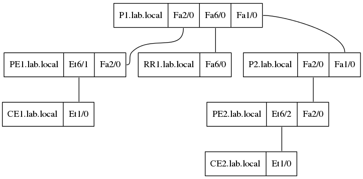

# Homework 2: Create Summary Reports

The second homework (or hands-on assignment) is to create summary reports.
The idea is to collect information from the network devices and turn
that into an easily readable report that is useful on its own.

## Creating a Network Topology Diagram

This course does not require to solve a set of specific problems, it
rather sets a theme to follow and provides the student with ideas. One of
the given ideas is to create a network graph based on neighbor information
collected from the devices. I like this idea, because it provides me
with an opportunity to look into
[Graphviz](http://graphviz.org/)
which is a suggested tool to visualize (i.e. generate an image file of)
the connectivity graph.

This problem has some relation to the
[Prescriptive Topology Manager](https://github.com/CumulusNetworks/ptm)
from Cumulus Networks
([PTM Documentation](https://docs.cumulusnetworks.com/display/DOCS/Prescriptive+Topology+Manager+-+PTM))
which uses a file in Graphviz format named `topology.dot` to describe
the intended network topolgy and uses the Link Layer Discovery Protocol
(LLDP) to compare the switch's neighbors with the given topology.

Since I am using virtual Cisco IOS devices in my
[lab](../hw1-the_lab/),
I am using the Cisco Discovery Protocol (CDP, also known as CiscoDP on
Enterasys (now ExtremeEOS) switches, sometimes known as Industry Standard
Discovery Protocol (ISDP) as well) as data source.

### Approaching a Solution

I intend to use the
[`ios_command`](http://docs.ansible.com/ansible/latest/ios_command_module.html)
module to collect CDP data from the virtual routers. The output is then parsed
by an Ansible filter (one of the
[`parse_cli` or `parse_cli_textfsm`](http://docs.ansible.com/ansible/latest/playbooks_filters.html#network-cli-filters)
filters) into variables. The
variables are used together with a
[jinja2 template](https://docs.ansible.com/ansible/latest/playbooks_templating.html)
to generate a network topology description in Graphviz format,
i.e. using the
[DOT language](https://graphviz.gitlab.io/_pages/doc/info/lang.html).
The
[dot](https://graphviz.gitlab.io/_pages/pdf/dotguide.pdf)
program is used to create an image file in
[PNG](http://www.libpng.org/pub/png/)
format.

---

### Interlude 1: Beating Ansible Installation into Shape

When I tried to use the `ios_command` module, it would fail with the error
message:
`unable to open shell. Please see: https://docs.ansible.com/ansible/network_debug_troubleshooting.html#unable-to-open-shell`
Root cause was that `pip install ansible` did not install all requirements
for the `ios_command` module, it missed the two Python packages `enum34` and
`ipaddress`. For all the gory details see the separate
[Interlude 1](interlude1.md) document.

---

### Ansible Playbook

The solution approach provides a general structure for the Ansible playbook
[`topology.yml`](ansible/playbooks/topology.yml). I have used `tags` to allow
invoking parts of the playbook that belong together:

* `get` retrieves CDP neighbor information from network devices and writes the
   raw CLI output to a file
* `parse` reads the raw CLI output from file and parses it into a data structure
* `graph` uses the data structure from the `parse` step to generate a DOT
   language description of the graph (`connectivity.gv`) and a PNG image
   visualizing it (`connectivity.png`)
* `debug_*` tags allow debugging of the respective steps

---

### Interlude 2: Lab Configuration

The lab as configured for [homework 1](../hw1-the_lab) lacks interesting
connectivity, thus I needed add some configuration. This is described in
the separate [Interlude 2](interlude2.md) document.

---

### Playbook Description

The following sections provide more information about the Ansible playbook
to create a visualization of the network connectivity.

#### One Play

The playbook comprises one play with several tasks. The network devices used
are specified at play level (the `OOB` group using the OOB interfaces, since
in-band connectivity is not yet established). Additionally, use of the `local`
connection is specified at play level, because all tasks are executed on
`localhost`:

* Files for intermediate steps and end result need to be created on the Ansible
  host.
* Ansible network modules are executed on the Ansible host, the module then
  connects to the network device.

A few variables to control where generated files are stored and how they are
named are defined at play level as well.

#### Tasks to Retrieve CDP Information

Four tasks (with the tag `get`) are used to retrieve CDP neighbor information
from the network devices. The first uses the `ios_command` module to issue
`show cdp neighbors detail` on each router. This information is written to
a text file in the fouth `get` task, after the second and thrid `get` tasks
have deleted old CDP information and (re-)created the directory to store it in.

#### Tasks to Parse CDP Information

Two tasks (with tag `parse`) are used to parse the CDP data to fill a data
structure that can be used in a Jinja2 template. The first reads the raw CDP
output using the Ansible `lookup` plugin `file`. The second uses the
`parse_cli_textfsm` filter with the
[TextFSM](https://github.com/google/textfsm)
[template](https://github.com/google/textfsm/wiki/TextFSM)
[`cdp_neighbors_detail.textfsm`](ansible/playbooks/cdp_neighbors_detail.textfsm)
to create a list with neighbor data.

#### Tasks to Graph the Topology

Four tasks (with tag `graph`) are used to generate an image that shows the
network topology. The first two tasks prepare the output directory, i.e.
they delete contents from previous playbook executions and (re-)create the
output directory. The third task uses the Ansible `template` module to
generate a DOT language description with the
[`connectivity.j2`](ansible/playbooks/templates/connectivity.j2)
Jinja2 template. The fourth task invokes the `dot` program using the Ansible
`command` module to generate a PNG image of the connectivity graph.

---

### Network Topology Visualization

The Ansible playbook [`topology.yml`](ansible/playbooks/topology.yml) generates
to result files:

1. The DOT language graph description [`connectivity.gv`](connectivity.gv)
2. The PNG image [`connectivity.png`](connectivity.png) of the topology

#### Topology Image

---

## References

* Ansible Filters
  * [`parse_cli`](http://docs.ansible.com/ansible/latest/playbooks_filters.html#network-cli-filters)
  * [`parse_cli_textfsm`](http://docs.ansible.com/ansible/latest/playbooks_filters.html#network-cli-filters)
* [Ansible Lookup Plugins](http://docs.ansible.com/ansible/latest/playbooks_lookups.html)
* Ansible Modules
  * [`ios_command`](http://docs.ansible.com/ansible/latest/ios_command_module.html)
  * [`ios_config`](https://docs.ansible.com/ansible/latest/ios_config_module.html)
* [Ansible Templating](https://docs.ansible.com/ansible/latest/playbooks_templating.html)
* [DOT language](https://graphviz.gitlab.io/_pages/doc/info/lang.html)
* [DOT language (Wikipedia)](https://en.wikipedia.org/wiki/DOT_%28graph_description_language%29)
* [dot program](https://graphviz.gitlab.io/_pages/pdf/dotguide.pdf)
* [Graphviz](http://graphviz.org/)
* [Jinja2](http://jinja.pocoo.org/)
* [PNG](http://www.libpng.org/pub/png/)
* [Prescriptive Topology Manager](https://github.com/CumulusNetworks/ptm)
* [PTM Documentation](https://docs.cumulusnetworks.com/display/DOCS/Prescriptive+Topology+Manager+-+PTM)
* [TextFSM](https://github.com/google/textfsm)
* [TextFSM template](https://github.com/google/textfsm/wiki/TextFSM)
* [YAML](http://yaml.org/)

---

[BNAS2018 GitHub repository](https://github.com/auerswal/bnas2018) | [My GitHub user page](https://github.com/auerswal) | [My home page](https://www.unix-ag.uni-kl.de/~auerswal/)
